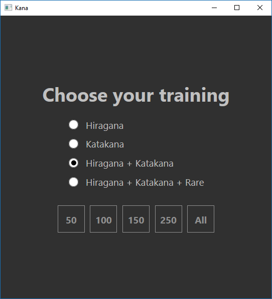
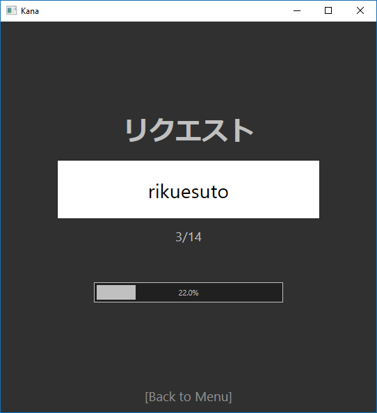
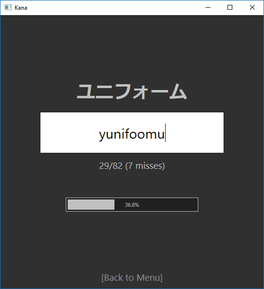
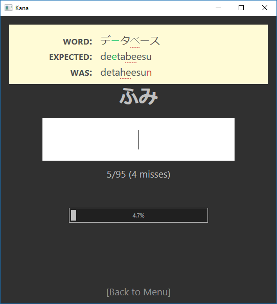
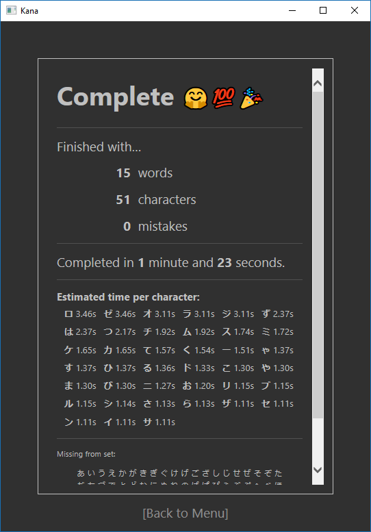
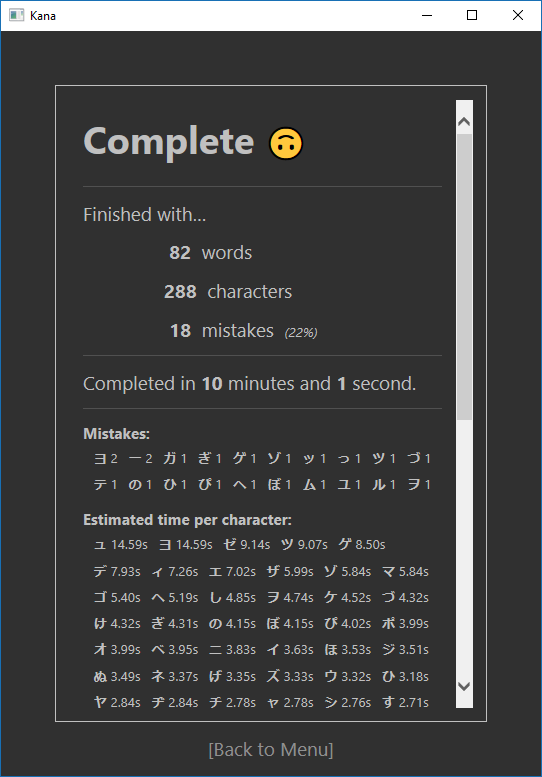

# Kana practice app

A Japanese Kana training application to practice
the recognition of **hiragana** and **katakana** characters
by translating them to rōmaji using real words.

**NOTE** this is __Windows__ only, as it uses a webview for
the UI.

Main features (see [screenshots](#screenshots-and-features)
below):

* Can generate a random training set for *hiragana*, *katakana*
or both.
* Words are taken from a real word list. The choice of words is
random but it is weighted so common words have a higher chance
to appear.
* Can generate a training set including all chosen characters
(as long as the length is enough or if the option "All" is used).
* Error report highlighting the error and showing the correct
translation.
* Full report with statistics at the end of the training set.

This is a spare time project. The app was developed in Rust with
the purpose of learning the language while also creating a tool
that I missed while studying Japanese.

## Building

The project uses [Cargo](https://doc.rust-lang.org/cargo/),
so as long as you have Rust properly setup, you can build it
with `cargo build` and run with `cargo run`.

See also: [technical details](#technical-details)

## Screenshots and features

Choose the training set (katakana, hiragana or both) and
length:

Note that length is in number of characters (not words) and
that choosing *"All"* generates the minimum set with all characters.

The guess screen displays the number of words, overall progress…

…and the number of errors.

Mistakes are displayed in the next screen and highlighted:

Pressing *Enter* dismisses the error popup and resets the timer
for the current screen.

At the end of the training set a report is shown with completion
time, overall status and time average per character (estimate):

Mistakes are also broken down per character:

If the set length was not enough to include all characters, the
report screen will also display any missing ones, as shown above.

## Future improvements

* [ ] Use an alternative to the webview that works on other platforms
  and is not IE
* [ ] Better diff algorithm for errors (e.g. split the romaji
  syllables when diffing and diff based on similarities)
* [ ] Persist statistics and settings
  * Additionally: provide statistics across multiple sessions
* [ ] Option to finish training session early
* [ ] Proper build
* [ ] User documentation
* [ ] More words, Kanji, …

## Technical details

The application is split in two main crates:

* [kana](kana/) contains the library for handling kana, romaji,
  generating the word list, diffing results, etc.
* [kana_app](kana_app/) contains the UI implementation, application
model and the [JavaScript files](kana_app/ui) for the webview.

### Kana library

The [kana](kana/) crate contains the main implementation for the
application logic:

* The list of words and respective frequency are loaded from
  [`words.txt`](kana/words.txt) by [`build.rs`](kana/build.rs).
* [`tables.rs`](kana/src/tables.rs) contains the translation tables
  between kana and romaji.
* [`split.rs`](kana/src/split.rs) implements splitting a kana word
  in its component romaji elements. It is split by syllables to make
  it easier to map the diff back to the kana. This is the core of the
  application.
* [`wordset.rs`](kana/src/wordset.rs) manages generating the random
  set of words.
* [`diff.rs`](kana/src/diff.rs) provides the word diffing that is used
  to detect and display mistakes.
* [`romaji.rs`](kana/src/romaji.rs) contains the glue logic for all
  the components above.

### User interface and web UI

The UI uses [web-view](https://github.com/Boscop/web-view). The HTML
and related files are embedded by [`main.rs`](kana_app/src/main.rs)
using code in [`html.js`](kana_app/src/html.rs), that also inlines
the JS and CSS in the HTML.

Although the files are embedded in the executable, debug builds do
support code reloading for the web files. Pressing F5 in the web
interface will attempt to reload the files from source and then
refresh the UI. The application data is kept by the Rust side, as
such refreshing the UI will not lose the application state.

The page is loaded through a simple HTTP webserver in
[`server.rs`](kana_app/src/server.rs). This is necessary to support
reloading the webview, as the other option is to use `data:` to load
content and trying to change the URL in that case would not work
because of cross-site restrictions.

The JavaScript files are in [`kana_app/ui`](kana_app/ui). The UI uses
the [Vue.js](https://vuejs.org/) library.

Note that any file referenced in the HTML must also be included in
`main.rs` for it to be available.

### Application model

The application model is defined by [`model.js`](kana_app/src/model.rs).

The Rust side of the application is responsible for maintaining and
updating the model.

The JavaScript app only handles events and send them as messages to
the Rust host. In response to those messages, the Rust side updates
the model and send back the entire updated model.

On the JavaScript side, the message passing mechanism is implemented
by [`base.js`](kana_app/ui/base.js).
